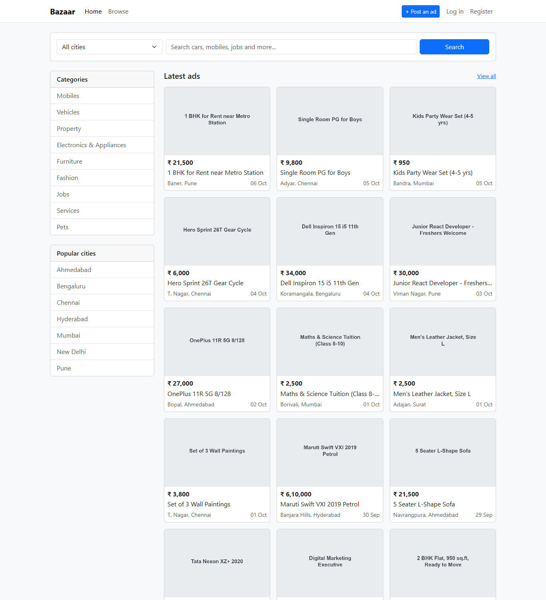
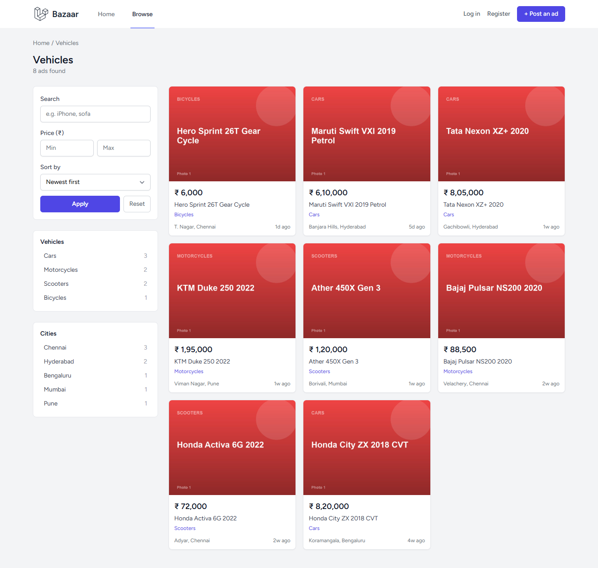
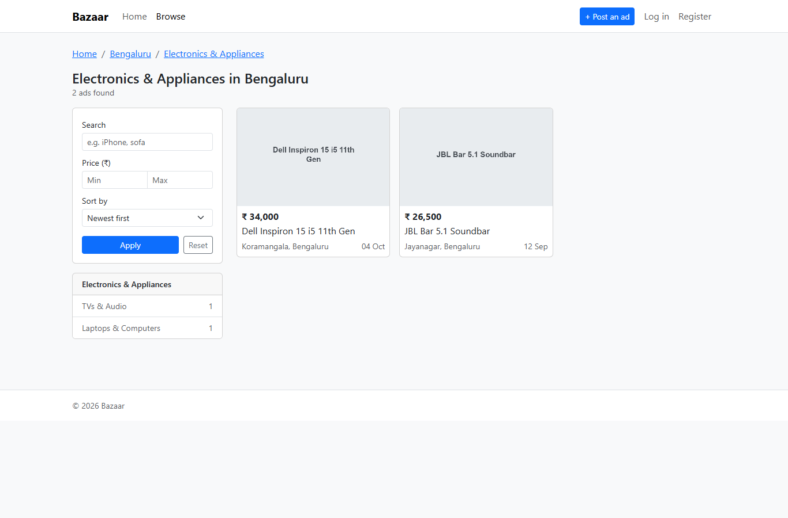
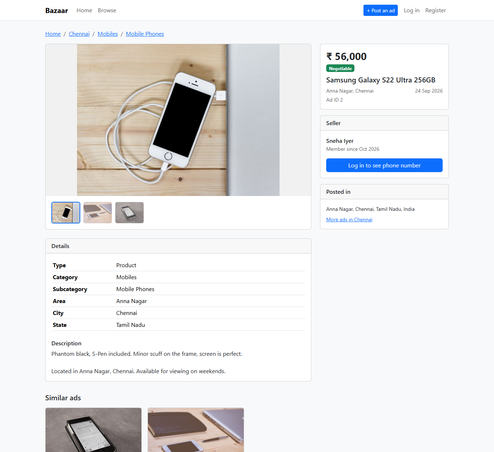
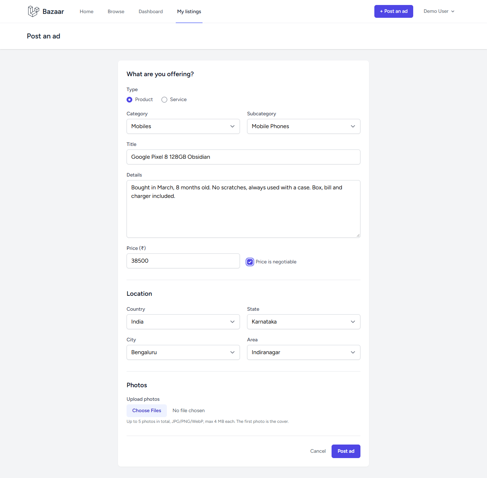
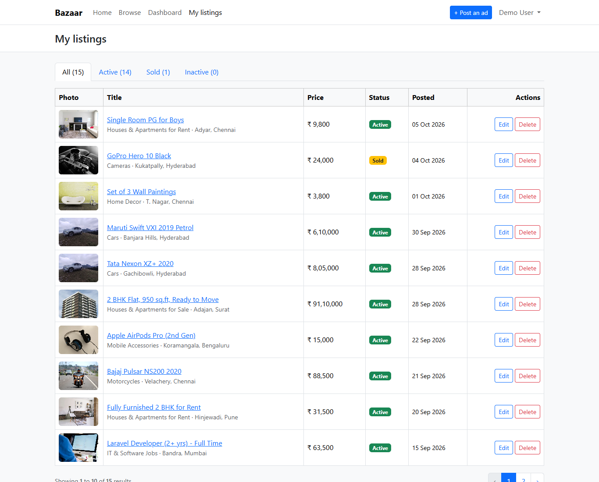
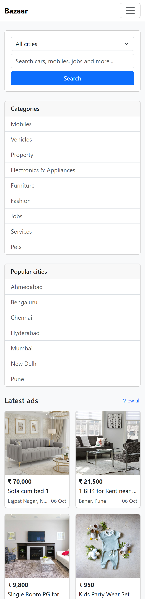
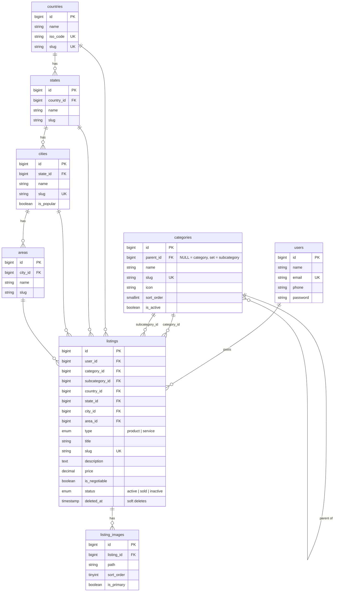

# Bazaar – OLX-style marketplace in Laravel

A classifieds marketplace where users register, post products or services with a category and full location (country → state → city → area), and browse listings by category, by city, or by city + category.

Built with **Laravel 12**, **Breeze** auth (Blade views), **Bootstrap 5**, jQuery Validation, a little Alpine.js and **MySQL**.



## Requirements covered

| Requirement | Where |
|---|---|
| User registration / login | Laravel Breeze: `/register`, `/login` |
| Add a product/service with name, details, category, subcategory, country, state, city, area, price | `/dashboard/listings/create` (dependent dropdowns, server-side validation, up to 5 photos) |
| Show listings on the frontend | Home page (latest ads) and `/listings` (search, price filter, sort) |
| Category-wise listings | `/category/{category}`, e.g. `/category/vehicles` or `/category/cars` (subcategory) |
| City-wise listings | `/city/{city}`, e.g. `/city/pune` |
| City + category-wise listings | `/city/{city}/{category}`, e.g. `/city/mumbai/vehicles` |
| Listing detail page | `/listing/{slug}` |

Every form (search, filters, login, register, password forms, profile, post/edit ad) is validated in the browser with **jQuery Validation** (no browser popups) and again by **Laravel** on the server. Passwords must be strong (8+ characters, upper and lowercase letters, a number and a symbol), and the register form shows a live checklist, a strength meter and a "suggest a strong password" button.

Extras: My Listings (edit, mark as sold or inactive, delete), dashboard stats, similar ads, photo gallery, Indian price formatting (₹ 5,00,000), mobile-friendly layout, 46 feature tests.

## Setup

Requirements: PHP 8.2+ (with `gd`, `pdo_mysql`, `fileinfo`), Composer, Node 18+, MySQL/MariaDB (e.g. XAMPP).

```bash
git clone <repo-url> bazaar && cd bazaar
composer install
npm install && npm run build

cp .env.example .env
php artisan key:generate
```

Create an empty database called `laravel_marketplace`, then check the `DB_*` values in `.env` (default: `root` with no password on port 3306; XAMPP is sometimes set to 3307).

```bash
php artisan migrate --seed   # tables + categories, locations, 5 demo users, 63 demo listings with photos
php artisan storage:link     # makes uploaded photos public
php artisan serve
```

Open http://127.0.0.1:8000. If port 8000 is taken, use `php artisan serve --port=8001` and set `APP_URL=http://127.0.0.1:8001` in `.env` so photo URLs match.

### Demo accounts

All passwords are `password`.

| Email | Notes |
|---|---|
| `demo@example.com` | Main demo account with its own listings |
| `rahul@example.com`, `priya@example.com`, `arjun@example.com`, `sneha@example.com` | Other sellers |

### Tests

```bash
php artisan test
```

Tests run on in-memory SQLite (see `phpunit.xml`), so they never touch the MySQL data.

## Screenshots

| Category page | City + category page |
|---|---|
|  |  |

| Listing detail | Post an ad |
|---|---|
|  |  |

| My listings | Mobile |
|---|---|
|  |  |

## Database design



## Design decisions

- **One self-referencing `categories` table.** `parent_id = NULL` is a category and a set `parent_id` is a subcategory. Both share one slug space, so `/category/{slug}` works for either level, and the `Listing::inCategory()` scope picks the right column.
- **Separate location tables** (countries → states → cities → areas) instead of free text, so cities and areas are consistent and can be browsed.
- **The full category and location chain is stored on each listing.** Area alone would be enough to work out the rest, but storing `category_id`, `city_id` and the others means every browse page (category, city, city + category) is a single indexed `WHERE` with no joins. Composite indexes such as `(city_id, category_id, status)` match those queries.
- **Hierarchy validated on the server.** `StoreListingRequest` checks that the subcategory belongs to the category, the state to the country, the city to the state and the area to the city, so a tampered form cannot save inconsistent data. The dropdowns are only a convenience.
- **Slugs in public URLs.** Listing slugs get a random suffix (`honda-city-zx-2018-cvt-sjvbsz`), so they stay unique without an extra query and don't change when the title is edited.
- **Authorization with `ListingPolicy`.** Only the owner can edit or delete. Inactive listings return 404 to everyone else, while sold listings stay visible with a "sold" notice.
- **Soft deletes** on listings, so a deleted ad could be restored.
- **Validation in two layers.** jQuery Validation (`resources/js/auth-validation.js`, loaded only on the login and register pages) gives instant feedback; Laravel validates everything again, because browser checks can be bypassed. The strong password rule is set once with `Password::defaults()` in `AppServiceProvider`, so register, reset password and change password all enforce it.
- **No N+1 queries.** Listing cards eager-load the cover photo, city, area and subcategory through `Listing::withCardData()`.

## Project structure (main files)

```
app/Http/Controllers/
    HomeController.php        home page
    BrowseController.php      /listings, /category, /city, /city/{city}/{category}
    ListingController.php     listing detail page
    MyListingController.php   create / edit / delete own listings
    AjaxController.php        JSON for the dependent dropdowns
app/Http/Requests/            StoreListingRequest, UpdateListingRequest
app/Policies/ListingPolicy.php
app/Models/                   Listing, Category, Country, State, City, Area, ListingImage, User
database/seeders/             CategorySeeder, LocationSeeder, DemoListingSeeder
resources/js/listing-form.js  Alpine component for the listing form
resources/views/              home, browse/, listings/, my-listings/
tests/Feature/                HomePageTest, BrowseListingsTest, ManageListingsTest (+ Breeze auth tests)
```
